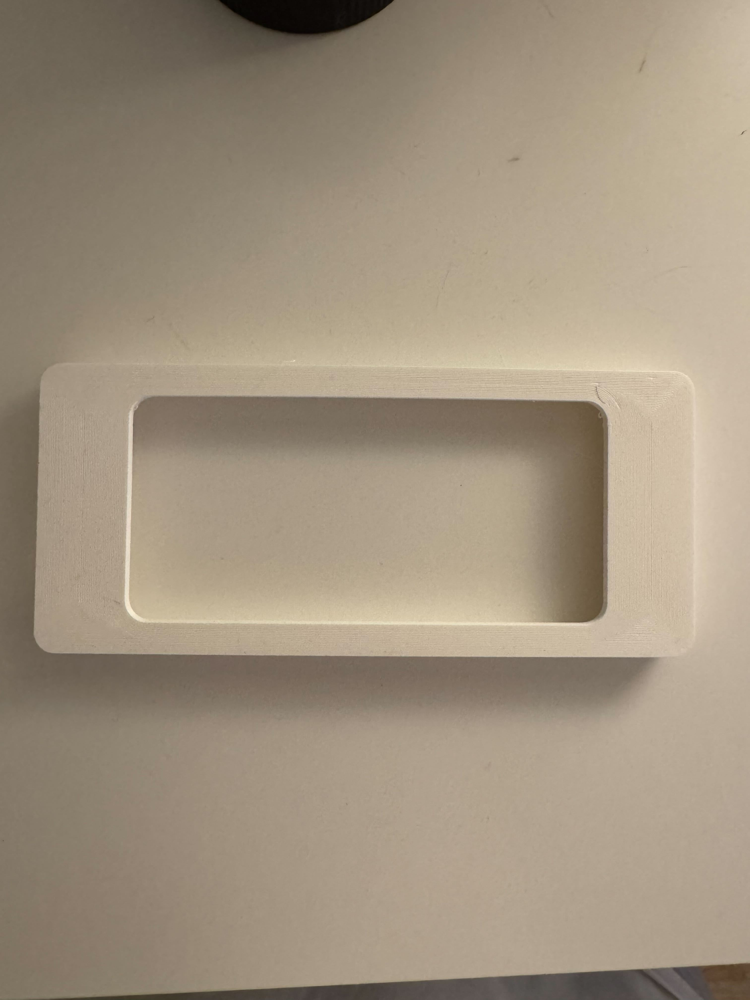
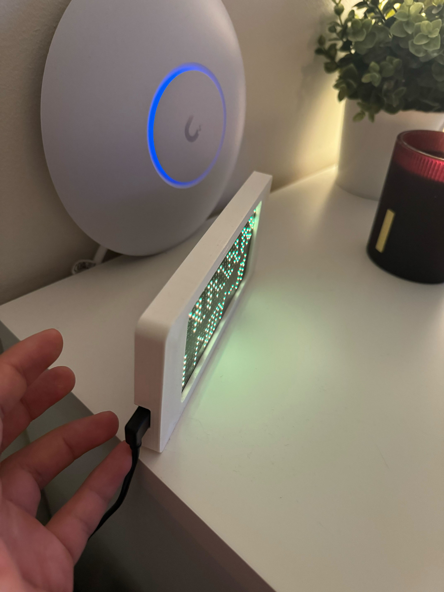
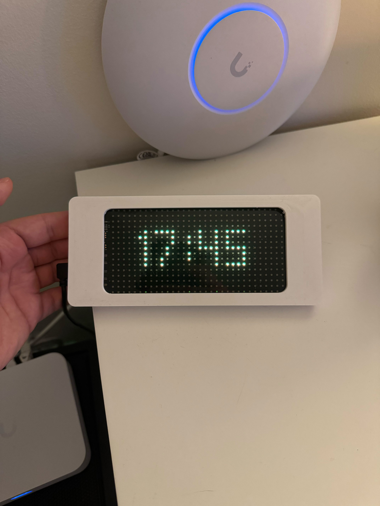
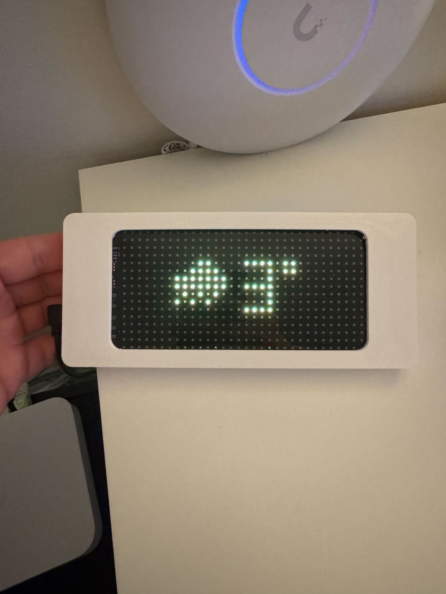

## Why I did this?

A bit of context: 
1. My girlfriend wanted a product that she saw on internet, an expensive led screen for more than 200 EUR that only displays the incoming train departures.
2. My mind said: Yeah, of course I can do that, free API, full knowledge in electronics and embedded programming, will be fun. And it will prove to her that I'm a Handy man!.

## Tools I used

1. My battle tested rooted xiaomi mi 9.
2. A 30 EUR chinese led display from amazon.
3. My 3D printer and FreeCad.
3. My PC and a rainy weekend.

## The reverse engineering

Well, I need to explain that the led display has two ways to operate it, one with a remote control and the other one with a mobile app. So my first thought was that the connection between the led display and the App is made via Bluetooth.

The next step was easy, install the app, play a bit with the display and render some text, numbers, colors, enable scroll, etc.

Finally I just need to capture some **Bluetooth HCI snoop logs**, which is easy with android, the steps are:

1. Enable developer options.
2. Toggle **Enable Bluetooth HCI snoop log**.
3. Turn OFF and ON the bluetooth.
4. Play with the app, in this case since I wanted to render TEXT I started rendering something easy to search into the logs, the text AAAA, then BBBB, CCCC, 1111, etc.
5. Then, since the device is rooted I was able to access to the logs in a route similar to this one */data/misc/bluetooth/logs/*.
6. Use adb to move the files to the Mac where I will start with the difficult part.

Once u have the logs I used https://www.wireshark.org/ to analyze them, it took me a while to find patterns, like ATT commands from the app, headers in messages, responses, etc.

After few hours I find out some patterns and I created some python scripts to search BT devices, connect with the devices and send ATT commands basically trying to replicate the same behaviour that I recorded when used the app.

My first try was to be able to render the letters AAAA, BBBB, CCCC, it worked after some code tweaks.
My second try was to be able to turn on and off the screen. It didnt work but I found an USB cable with a switch, so no problem at all.
My third try was to be able to send colors, so again, record AAAA with blue, then AAAA with red, and find differences, after some time I find out the pattern and again, with python, I was able to send text in different colors to the screen.

I felt very successful when I was able to send text to the screen and change its color, then I was ready to implement the train departure feature.

### The development

I bought an ESP32 to be able to query the train departure API and render into the screen, but after some thinking I decided to create a golang aplication to run in my home server, basically because I needed an extra circuit to source the ESP32, the case for the led display will need to be bigger because the ESP32, and I would need to solder and I thought is easier to build an app in golang than soldering and doing c / c++. (Maybe in the future if I have some free time I will port the golang app to the esp32).

After decided for the golang development eveything was way easier, a basic go application with:

1. Bluetooth connection to an specific bluetooth address.
2. Client to my current public train system API in my city.
3. I added also some extra screens like a weather client to show the current weather in my location.
4. Local web server to tweak a bit the screen.

Then the latest part was design a custom 3d printed case using FreeCad

## Key Result

1. I wanted something small and I finished with an small case as you can see below:

2. I added the time, I put it in the living room, next to the wifi router, so we can see it at any time, I think the hour is very useful since we dont have a proper clock, so this one works and matches with our space

3. Of course I added the weather, since I move to europe this is something very important for me, be able to know how many layers I should use before go outside and if I should take the umbrella with me.

## What’s Next?

I guess I will add some more tweaks later, like weather during the day, forecast, or maybe connect it with the calendar to display small reminders, and my gf wants a black case for it because the screen is black, so I will print another one just to see how it looks in black case.

At the end I'm very happy with the product and here u can find the link to the project with some Bluetooth logs, the golang code and some python scripts

https://github.com/jpvargasdev/MachineSpiritTimetable